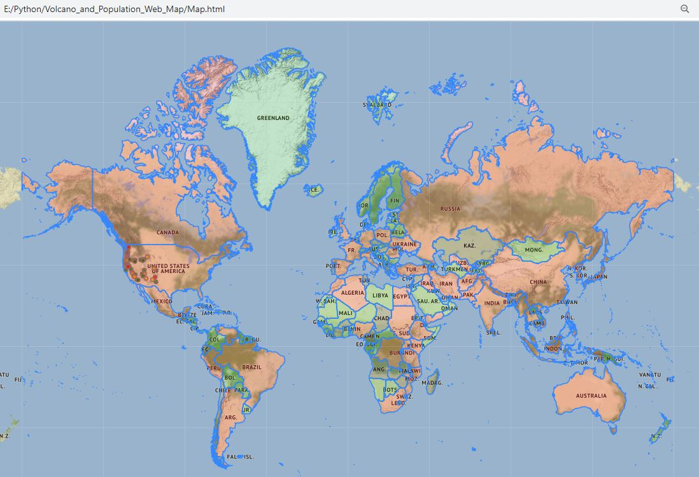
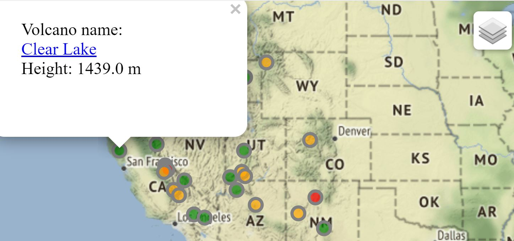

# Volcano-and-Population-Web-Map
Snip of my output :arrow_down:  
###### A choropleth map showing colored polygons to represent the population of areas

###### Add and style points to represent the elevation of volcano

